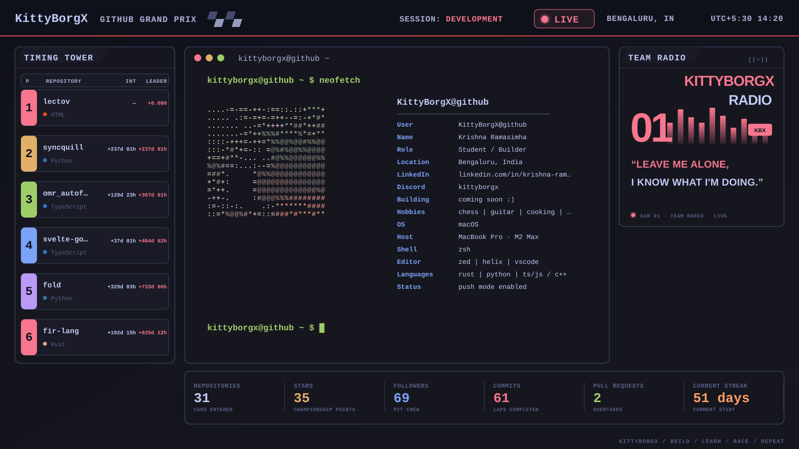

<picture>
  <source
    media="(prefers-color-scheme: dark)"
    srcset="./assets/profile-tokyonight.svg"
  >
  <source
    media="(prefers-color-scheme: light)"
    srcset="./assets/profile-gruvbox.svg"
  >
  
</picture>

